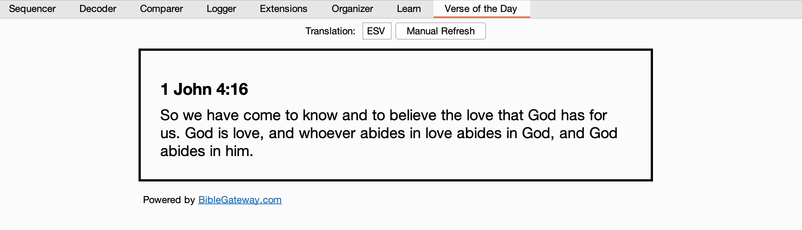

# Verse of the Day - Burp Suite

Verse of the Day is a Burp Suite extension designed for Christian
penetration testers. It fetches the current verse of the day from the
[BibleGateway](https://biblegateway.com) API in the user's preferred
translation. With just a click to the Verse of the Day tab, users can
draw inspiration and motivation from scripture amidst their testing tasks.



## Build and Installation

### Releases Page

For those who prefer direct downloads, the latest built versions of the 
extension can be found on the
[Releases page](https://github.com/gaberust/burpvotd/releases).

### Building with Maven

If you'd like to build the project from source using Maven:

1. Clone the repository:
```bash
git clone https://github.com/gaberust/burpvotd.git
```

2. Navigate to the project directory:
```bash
cd burpvotd
```

3. Build the project using Maven:
```bash
mvn package
```

After these steps, you'll find the built `.jar` file in the `target` directory.
Use the one that does NOT start with `original-`: it does not include the required dependencies.

### Building with IntelliJ

If you're using IntelliJ IDEA:

1. Open IntelliJ and go to `File` -> `Open`.
2. Navigate to the cloned directory and open the project.
3. In the right-hand pane, under the `Maven` tab, expand the `Lifecycle` section.
4. Double-click on `package` to build the project.

After these steps, you'll find the built `.jar` file in the `target` 
directory. Use the one that does NOT start with `original-` (it does not 
include the required dependencies).

## Feedback and Contributions

Your feedback is important for improving the Verse of the Day extension. If you come across any issues or have suggestions, please raise them in the [Issues section](https://github.com/your-username/verse-of-the-day-burpsuite-extension/issues) of this repository.

Contributions to the codebase are welcome! To contribute, please fork the repository, make your changes, and then submit a pull request.
